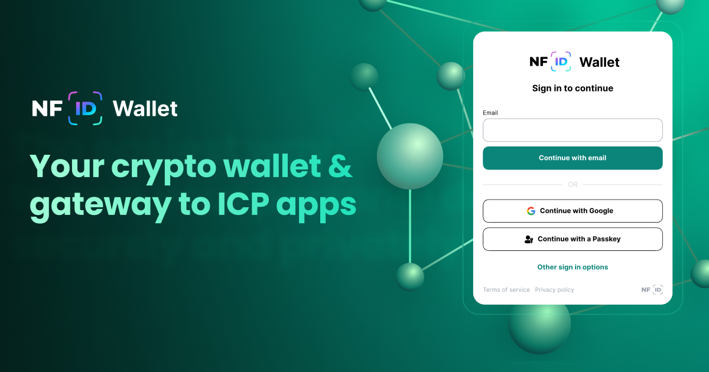

<div style="display:flex;flex-direction:column;">
  <a href="https://nfid.one/">
    
  </a>

<br/>
<br/>

**Wallet backend tests**
<br/>
[](https://github.com/internet-identity-labs/nfid-wallet-server/actions/workflows/delegation_factory.yml)
[](https://github.com/internet-identity-labs/nfid-wallet-server/actions/workflows/identity_manager.yml)
[](https://github.com/internet-identity-labs/nfid-wallet-server/actions/workflows/nfid_storage.yml)
[](https://github.com/internet-identity-labs/nfid-wallet-server/actions/workflows/swap_trs_storage.yml)

**ICRC1 public token registry API tests**
<br/>
[](https://github.com/internet-identity-labs/nfid-wallet-server/actions/workflows/icrc1_oracle.yml)
[](https://github.com/internet-identity-labs/nfid-wallet-server/actions/workflows/icrc1_registry.yml)

# NFID Wallet

NFID Wallet is a simple, secure, browser-based, soon-to-be-DAO-controlled wallet powered by the Internet Computer Protocol's [Chain Fusion](https://internetcomputer.org/chainfusion) technology.

---

## Features

### Lowest barrier to entry

NFID Wallet takes wallet creation down from minutes to seconds with:
- Email onboarding
- Browser-based accessibility
- No need for a seed phrase

Users create an NFID Wallet on any browser from any device in seconds with just an email address. Email onboarding is a managed service offered by Internet Identity Labs, and users can switch this service off by enabling "self-sovereign mode" whereby only user-owned passkeys are able to authenticate wallet access. With this mode enabled, users can bypass email authentication altogether and authenticate directly with a passkey. If users attempt to use an email address, they will be required to authenticate with a passkey anyway.

### Highest security guarantees

In contrast to centrally-controlled browser extension or mobile app wallets, NFID Wallet requires only trust in the Internet Computer Protocol:
- Fully on-chain
- Fault-tolerant access
- ICP network key custody

The NFID Wallet frontend and backend code is stored on-chain and served directly into the browser environment, making both the frontend and backend tamper-resistant against malicious actors.

Seed phrases are a single source of failure that have led to the loss of trillions of dollars of crypto. Through the use of passkeys, users can set up multiple ways of authenticating to their wallet, all of which are extremely difficult to lose or steal.

NFID Wallet leverages ICP's native threshold ECDSA (and later threshold Schnorr) feature wherein the protocol handles the key-share distribution and signature generation across ICP nodes. Read more in [DFINITY's forum post](https://forum.dfinity.org/t/threshold-ecdsa-cryptography-review-by-ncc-group-third-party-security-audit-3/13853) about NCC Group's [public audit report for this feature](https://www.nccgroup.com/us/research-blog/public-report-threshold-ecdsa-cryptography-review/).

Users have extremely high security guarantees against malicious code updates, lost logins, and lost private keys.

### Future roadmap

#### SNS DAO (imminent)

In the very near future, NFID Wallet plans to commit itself to DAO control through DFINITY's SNS launchpad, after which all code updates and treasury allocations will require DAO approval.

#### Dynamic swaps

With a variety of DEXs on ICP, each with different price markets and liquidity levels, users never know where they can get the best price for their swaps. NFID Wallet plans to create a system of dynamic swaps to route one swap across multiple DEXs to get the most tokens out of the swap.

#### One balance

Paying for gas or making other purchases across networks in a pain. Leveraging ICP's threshold signatures allows NFID Wallet to support a feature where users will be able to pay on any chain with any token they want.

---

## Navigating this repository
- [What you'll find](#what-youll-find)
- [Prerequisites](#prerequisites)
- [Getting Started](#getting-started)
  - [Launch Local DFX](#launch-local-dfx)
  - [Deploy Identity Manager](#deploy-identity-manager)
  - [Configure for Test Environment](#configure-for-test-environment)
  - [Synchronize Controllers](#synchronize-controllers)
  - [Run Satellite Applications](#run-satellite-applications)
- [Integration Tests](#integration-tests)
  - [Prerequisites](#integration-tests-prerequisites)
  - [Run Integration Tests](#run-integration-tests)
- [Community & Support](#community--support)

---

## What you'll find

The current repository is the canister backend codebase for NFID Wallet, where you'll find setup, deployment, and testing instructions, as well as technical information on its architecture.

---

## Prerequisites

Ensure you have the following tools installed before diving into development:

- **Rustup** `^v1.27.1`
- **DFX** `^v0.22.0`
- **jq** `^1.6`

> ⚠️ Note: These versions are specific for compatibility with the Internet Computer SDK.

---

## Getting Started

### Launch Local DFX

Begin by starting a local DFX instance:

```bash
dfx start --background --clean
```

### Deploy Identity Manager

To deploy the Identity Manager canister with the specified ID, run:

```bash
dfx deploy identity_manager --no-wallet --specified-id "74gpt-tiaaa-aaaak-aacaa-cai"
```

### Configure for Test Environment

Configure the test environment by executing:

```bash
dfx canister call identity_manager configure '(record {env = opt "test"})'
```

### Synchronize Controllers

To sync controllers, use:

```bash
dfx canister call identity_manager sync_controllers
```

### Run Satellite Applications

Deploy additional canisters with these commands:

```bash
dfx deploy icrc1_registry  --argument '( record { im_canister = opt "74gpt-tiaaa-aaaak-aacaa-cai" })'
dfx deploy icrc1_oracle  --argument '(opt record { im_canister = opt principal "74gpt-tiaaa-aaaak-aacaa-cai" })'
dfx deploy signer_ic  --argument '(opt record { im_canister = principal "74gpt-tiaaa-aaaak-aacaa-cai" })'
dfx deploy delegation_factory  --argument '(opt record { im_canister = principal "74gpt-tiaaa-aaaak-aacaa-cai" })'
dfx deploy nfid_storage  --argument '(opt record { im_canister = principal "74gpt-tiaaa-aaaak-aacaa-cai" })'
dfx deploy swap_trs_storage  --argument '(opt record { im_canister = principal "74gpt-tiaaa-aaaak-aacaa-cai" })'
```

---

## Integration Tests

### Prerequisites

Install these dependencies before testing:

- **NodeJS** `^v20.16.0`
- **Yarn** `^v1.22.22`

### Run Integration Tests

To run the integration tests, use:

```bash
npm i && npm run test
```

---

## Community & Support

Join the NFID Wallet community to ask questions, get support, and stay updated!

- [Discord](https://discord.gg/a9BFNrYJ99)
- [OpenChat](https://oc.app/community/66hym-7iaaa-aaaaf-bm7aa-cai/channel/1241143482/?ref=prkg5-paaaa-aaaaf-aqbia-cai)

> **Web3 is all about community!** Let’s build, support, and grow together 🚀
